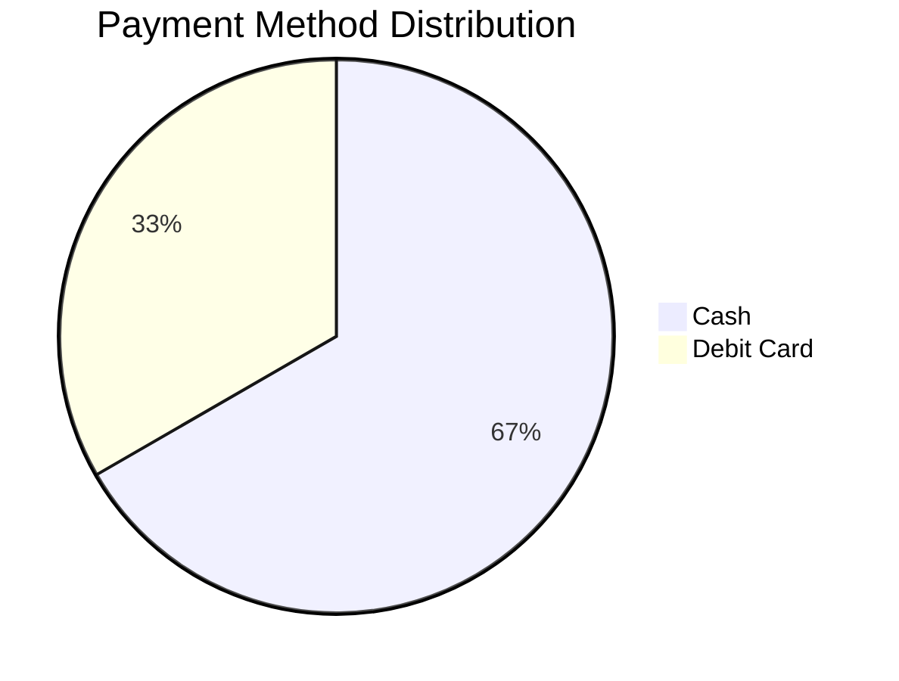
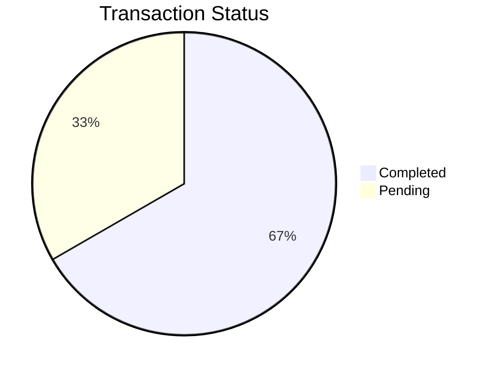

### Report Generated On: 2025-07-04 11:26:22.130205 

--- 

# Strategic Transaction Analysis Report

## 1. Executive Summary

This report presents an analysis of the provided transaction data. While the data is limited, we have identified initial trends and potential areas for improvement. Key findings include:

*   **Low Budget Consumption:** Current spending is significantly below both monthly and yearly budget allocations.
*   **Payment Method Distribution:** Cash and Debit Card payments are observed, with cash transactions being more frequent.
*   **Data Limitations:** The analysis is constrained by the limited volume and scope of the transaction data. Further data collection is crucial for more accurate and actionable insights.

This report outlines potential strategies for expense optimization and budget management, while acknowledging the need for more comprehensive data to refine these strategies.

## 2. Behavioral Segmentation Profiles

### Customer Segmentation

**Finding:** Insufficient data for meaningful customer segmentation. Requires customer identifiers and a larger transaction history.

**Recommendation:** Implement a system to track transactions by customer ID. Collect demographic and behavioral data to enable segmentation based on spending patterns, preferences, and life events.

### Life Event Detection

**Finding:** Insufficient data for life event detection. Requires longitudinal spending data over an extended period.

**Recommendation:** Track spending patterns over time to identify significant changes that may indicate life events (e.g., marriage, childbirth, job loss).

### Subscription Patterns

**Finding:** No subscription-related transactions identified.

**Recommendation:** If subscriptions are relevant to the business, ensure that these transactions are properly categorized and tracked.

### Payment Method Distribution

**Analysis:**

*   Cash: 66.67%
*   Debit Card: 33.33%

**Visualization:**

**Recommendation:** Analyze the reasons for the prevalence of cash transactions. Consider incentives to encourage the use of electronic payment methods for better tracking and potential cost savings.

### Transaction Status Analysis

**Analysis:**

*   Completed: 66.67%
*   Pending: 33.33%

**Visualization:**

**Recommendation:** Investigate the reasons for pending transactions. Implement processes to ensure timely resolution of pending transactions to improve cash flow management.

## 3. Liquidity Risk Dashboard

### Liquidity Risk Score

**Finding:** Insufficient data to calculate a meaningful liquidity risk score.

**Recommendation:** Collect comprehensive inflow/outflow data, including accounts receivable, accounts payable, and other liabilities. Develop a liquidity risk scoring model based on key financial ratios.

### Days of Runway

**Finding:** Insufficient data to calculate days of runway.

**Recommendation:** Collect comprehensive inflow/outflow data to project the number of days the business can operate with its current cash reserves.

## 4. Fraud Network Mapping

### Fraud Network Analysis

**Finding:** Insufficient data for fraud network analysis.

**Recommendation:** Collect more transaction data, including counterparty information, to identify potential fraud patterns and networks. Implement fraud detection tools and procedures.

## 5. Expense Optimization Plan

### Recurring Expense Opportunities

**Finding:** Insufficient data to identify recurring expense optimization opportunities.

**Recommendation:** Categorize expenses to identify recurring costs. Negotiate with vendors to reduce costs, consolidate services, or explore alternative providers.

### Budget Consumption

**Analysis:**

*   Monthly Budget Consumed: 0.02% (1.46 / 6000.0)
*   Yearly Budget Consumed: 0.002% (1.46 / 72000.0)

**Finding:** Spending is significantly below budget.

### Budget Overruns

**Finding:** No budget overruns identified.

### Year-End Projection

**Finding:** Insufficient data for year-end financial position projection.

**Recommendation:** Gather more comprehensive spending and income data to project the year-end financial position accurately.

### Overspend Impact

**Finding:** No overspend identified.

### Budget Recovery Roadmap

Since the budget is *not* exceeded, the following scenarios are hypothetical and for illustrative purposes only.

**Scenario:** Assume, *hypothetically*, the monthly budget was exceeded by $1000.

**Monthly Budget:** $6000
**Yearly Budget:** $72000
**Hypothetical Overspend:** $1000

**Plan A: Full Deduction from Next Month's Budget**

*   **Description:** Deduct the entire overspend amount ($1000) from the next month's budget.
*   **Next Month's Budget:** $6000 - $1000 = $5000
*   **3-Month Cash Flow Forecast (Illustrative):**
    *   Month 1: $5000
    *   Month 2: $6000
    *   Month 3: $6000
*   **Annual Savings Impact:** No direct savings, but ensures adherence to the overall budget.
*   **Risk:** May strain the next month's operations if expenses are inflexible.

**Plan B: Proportional Reduction Across Remaining Months**

*   **Description:** Divide the overspend amount ($1000) by the remaining months in the year and deduct proportionally. Assuming 11 months remaining: $1000 / 11 = $90.91 (approximately) reduction per month.
*   **Monthly Budget Reduction:** $90.91
*   **Adjusted Monthly Budget:** $6000 - $90.91 = $5909.09
*   **3-Month Cash Flow Forecast (Illustrative):**
    *   Month 1: $5909.09
    *   Month 2: $5909.09
    *   Month 3: $5909.09
*   **Annual Savings Impact:** No direct savings, but ensures adherence to the overall budget.
*   **Risk:** Requires careful monitoring to ensure that the reduced budget is sufficient for operational needs.

**Recommendation:**

Given the hypothetical overspend, **Plan B (Proportional Reduction)** is generally preferred as it distributes the impact more evenly, minimizing disruption to any single month's operations. However, the best approach depends on the specific circumstances and the flexibility of the budget. If the next month has unusually low anticipated expenses, Plan A might be feasible.

**Important Note:** This section is based on a *hypothetical* overspend scenario. In reality, spending is currently well within budget.

## 6. Appendix

### Full Transaction Table

| S.NO | DATE       | DESCRIPTION   | AMOUNT | PAYMENT METHOD | STATUS    | NOTES       |
|------|------------|---------------|--------|----------------|-----------|-------------|
| 01   | 2025-07-03 | A1B2C3        | 0.23   | Cash           | Completed | -------     |
| 02   | 2025-07-03 | A1B2C3        | 0.23   | Cash           | Completed | -------     |
| 03   | 2025-07-03 | arara         | 1.00   | Debit Card     | Pending   | dbcfjhrbf   |
