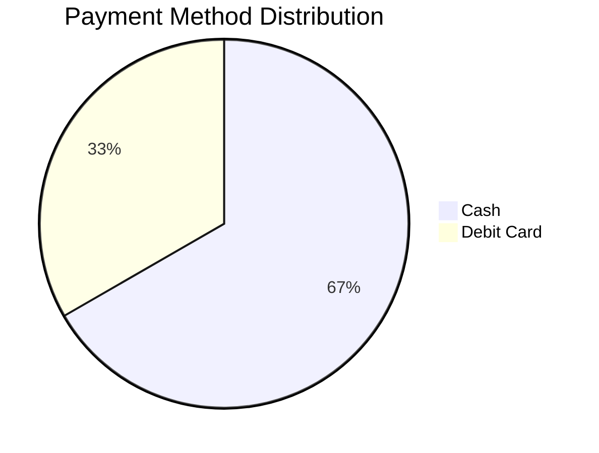
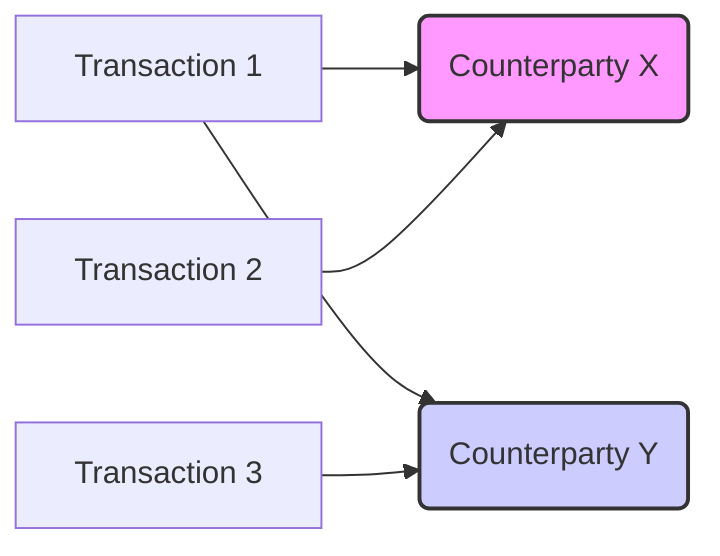

### Report Generated On: 2025-07-03 20:23:34.975476 

--- 

# Financial Strategy Report

**Date:** 2025-07-04

## 1. Executive Summary

This report provides an initial assessment of the company's financial transactions based on a limited dataset. Key findings include a net cash flow of -1.46, with primary outflows related to small cash and debit card transactions. Behavioral segmentation and liquidity risk analysis are limited due to insufficient data. A potential anomaly was detected in a pending debit card transaction. Expense optimization opportunities are difficult to identify with the current data volume, but initial budget analysis shows minimal budget consumption to date. Further data collection and categorization are crucial for a more comprehensive analysis and effective financial strategy development.

## 2. Behavioral Segmentation Profiles

### Impulse vs. Planned Spending

**Finding:** Insufficient data for customer segmentation. Requires more transactions to identify spending patterns.

**Recommendation:** Collect more transaction data over a longer period to analyze spending habits and identify potential customer segments.

### Life Event Detection

**Finding:** Insufficient data to detect life events. Requires longitudinal spending data.

**Recommendation:** Track spending patterns over time to identify significant changes that may indicate life events (e.g., marriage, childbirth, relocation).

### Subscription Patterns

**Finding:** No subscriptions identified in the dataset.

**Recommendation:** Monitor transactions for recurring payments to identify subscription services and assess their impact on cash flow.

### Payment Method Distribution

**Finding:** Payment method distribution is as follows:

*   Cash: 66.67%
*   Debit Card: 33.33%

**Visualization:**

**Recommendation:** Analyze the reasons behind the high percentage of cash transactions. Consider promoting electronic payment methods to improve tracking and potentially reduce transaction costs.

## 3. Liquidity Risk Dashboard

### Days of Runway

**Finding:** Cannot calculate days of runway without knowing the starting cash balance and ongoing expenses. More data needed.

**Recommendation:** Establish a system for tracking daily cash balances and ongoing expenses to accurately calculate the days of runway.

### Liquidity Risk Score

**Finding:** Insufficient data to calculate liquidity risk score.

**Recommendation:** Collect more data on cash inflows, outflows, and liabilities to develop a comprehensive liquidity risk score.

## 4. Fraud Network Mapping

### Common Counterparties

**Finding:** Insufficient data to perform fraud network analysis. Requires more transactions and identification of counterparties.

**Recommendation:** Implement a system for identifying and tracking counterparties involved in transactions to detect potential fraud networks.

### Anomalies

**Finding:** The 'arara' transaction for 1.00 via Debit Card and a 'Pending' status may warrant further investigation, given the other two transactions are small cash transactions and are 'Completed'. The 'dbcfjhrbf' note is also unusual.

**Recommendation:** Investigate the 'arara' transaction to verify its legitimacy. Review the 'dbcfjhrbf' note and determine its meaning. Implement fraud detection rules to flag similar transactions in the future.

### Fraud Network Map (Illustrative - Requires More Data)

## 5. Expense Optimization Plan

### Recurring Opportunities

**Finding:** Insufficient data to identify recurring expense optimization opportunities. Requires analysis of recurring transactions over time.

**Recommendation:** Track transactions over time to identify recurring expenses and assess opportunities for cost reduction.

### Budget Analysis

*   Monthly Budget: 6000.0
*   Yearly Budget: 72000.0
*   Total Spent: 1.46
*   Percent Monthly Consumed: 0.02%
*   Percent Yearly Consumed: 0.002%
*   Budget Overruns: No budget categories defined. Cannot identify overruns.
*   Year-End Projection: Based on the single day's spending, a simple projection would be 1.46 * 365 = 532.90. This is a naive projection and highly unreliable without more data.
*   Overspend Impact: Cannot quantify overspend impact without budget categories and spending targets.
*   Transaction Status Analysis:
    *   Completed: 66.67%
    *   Pending: 33.33%

**Recommendation:** Define budget categories and spending targets to track budget performance and identify potential overruns. Monitor the pending transaction and ensure timely resolution.

### Budget Recovery Roadmap

Since the current spending is significantly below budget, a recovery plan isn't immediately necessary. However, we'll outline potential plans for illustrative purposes, assuming a hypothetical overspend scenario. Let's assume, for example, that the monthly budget was exceeded by $1000.

**Hypothetical Overspend:** $1000

**Plan A: Full Deduction from Next Month's Budget**

*   Next Month's Budget: $6000 - $1000 = $5000

**3-Month Cash Flow Forecast (Under Plan A - Hypothetical)**

| Month     | Budget | Projected Spending (Assuming Current Rate * 30) | Net Cash Flow |
| --------- | ------ | ----------------------------------------------- | ------------- |
| August    | $5000  | $14.60                                          | $4985.40      |
| September | $6000  | $14.60                                          | $5985.40      |
| October   | $6000  | $14.60                                          | $5985.40      |

**Plan B: Proportional Reduction Across Remaining Months**

*   Remaining Months: 11
*   Monthly Reduction: $1000 / 11 = $90.91
*   Adjusted Monthly Budget: $6000 - $90.91 = $5909.09

**3-Month Cash Flow Forecast (Under Plan B - Hypothetical)**

| Month     | Budget    | Projected Spending (Assuming Current Rate * 30) | Net Cash Flow |
| --------- | --------- | ----------------------------------------------- | ------------- |
| August    | $5909.09 | $14.60                                          | $5894.49      |
| September | $5909.09 | $14.60                                          | $5894.49      |
| October   | $5909.09 | $14.60                                          | $5894.49      |

**Annual Savings Impact**

*   Plan A: Recovers the overspend in one month.
*   Plan B: Distributes the recovery over the remaining year, minimizing short-term impact on budget.

**Recommendation:** The optimal path depends on the company's liquidity risk profile. If liquidity is a concern, Plan B is preferable. If the company can absorb the full deduction, Plan A simplifies budget management. Given the current data, neither plan is needed, but this illustrates the decision-making process.

## 6. Budget Recovery Roadmap

Given the minimal spending against the budget, a formal budget recovery roadmap is not currently required. The focus should be on establishing robust tracking and categorization of expenses to enable effective budget management in the future.

## Appendix: Transaction Table

| S.NO   | DATE       | DESCRIPTION   |     AMOUNT | PAYMENT METHOD   | STATUS    | NOTES     |
|--------|------------|---------------|------------|------------------|-----------|-----------|
| 01     | 2025-07-03 | A1B2C3        |       0.23 | Cash             | Completed | -------   |
| 02     | 2025-07-03 | A1B2C3        |       0.23 | Cash             | Completed | -------   |
| 03     | 2025-07-03 | arara         |       1.00 | Debit Card       | Pending   | dbcfjhrbf |
